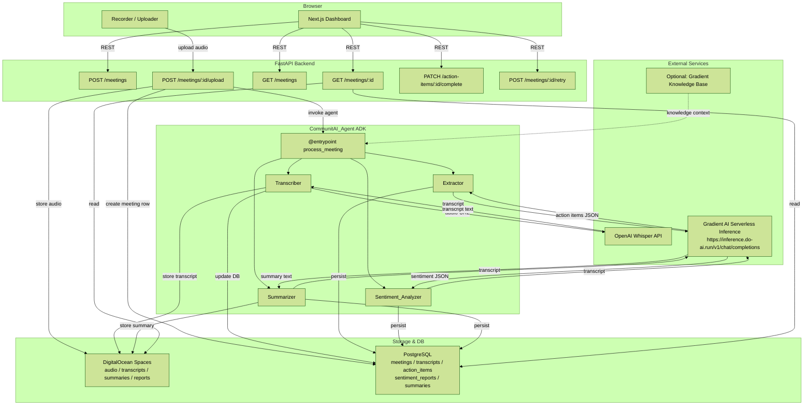

# Architecture

CommunitAI is an AI-powered Chief of Staff platform for community leaders. It automates the administrative overhead of community management by processing meeting recordings through a pipeline of transcription, action item extraction, sentiment analysis, and summary generation — all orchestrated by a single Gradient AI Agent.

The system is composed of three main layers:

- **Frontend** — Next.js + Tailwind CSS dashboard for recording, uploading, and reviewing meeting outputs
- **Backend** — Python FastAPI service that handles file ingestion, database operations, and agent invocation
- **AI Agent** — CommunitAI_Agent built with the DigitalOcean Gradient AI ADK, orchestrating all LLM and transcription tasks

## Design Goals

- Single agent entry point for all AI processing (ADK `@entrypoint` pattern)
- Sequential, fault-tolerant pipeline with per-step retry and status tracking
- Storage-first approach: audio, transcripts, and reports live in DigitalOcean Spaces; metadata and action items live in PostgreSQL
- Stateless frontend that polls/fetches from FastAPI — no direct AI calls from the browser

### System Architecture Diagram

### Data Flow Summary

1. User records or uploads audio in the browser
2. FastAPI stores the audio file in Spaces and creates a `meetings` row in PostgreSQL
3. FastAPI invokes the CommunitAI_Agent via ADK with the `meeting_id`
4. Agent runs the pipeline sequentially: Transcribe → Extract → Analyze → Summarize
5. Each step stores its output in Spaces and/or PostgreSQL and updates the meeting status
6. The Next.js frontend polls `GET /meetings/{id}` to display results as they become available
