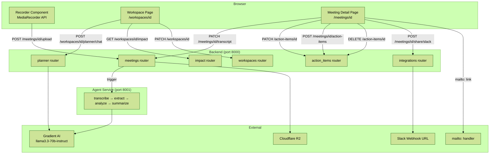

# Design Document — CommunitAI v2

## Overview

CommunitAI v2 extends the existing Bloomberg Terminal-style AI dashboard with six major capabilities:

1. **In-browser screen + audio recorder** — replaces file upload as the primary meeting capture method
2. **Inline editing** — transcript and action item corrections without leaving the meeting detail page
3. **Slack integration** — one-click posting of meeting summaries to a configured Slack channel
4. **Gmail integration** — `mailto:` link generation for email sharing (pure frontend)
5. **Planner Agent** — per-workspace AI chat assistant with meeting context
6. **Impact Tracker** — per-workspace analytics dashboard derived from existing data

All new features integrate into the existing stack: Next.js 15 + Tailwind v4 frontend, FastAPI + PostgreSQL backend (port 8000), and the Gradient AI agent service (port 8001). No new external services are introduced beyond the Slack webhook (user-supplied URL).

---

## Architecture

### Key Design Decisions

- **Recorder sends to existing upload endpoint** — the `POST /meetings/{id}/upload` endpoint already accepts any blob; the recorder simply sends a `video/webm` blob through the same `uploadAudio` API call. No new backend route needed for recording.
- **Planner Agent lives in the backend** — conversation history is persisted in a new `planner_messages` table so sessions survive page reloads. The backend builds the system prompt with workspace context on every request.
- **Impact Tracker is read-only** — all metrics are computed from existing tables at query time. No new data collection, no caching layer needed at this scale.
- **Gmail is pure frontend** — constructing a `mailto:` link requires no backend involvement and avoids OAuth complexity.
- **Slack webhook is stored per workspace** — the backend calls the webhook server-side to avoid exposing the URL in the browser.
